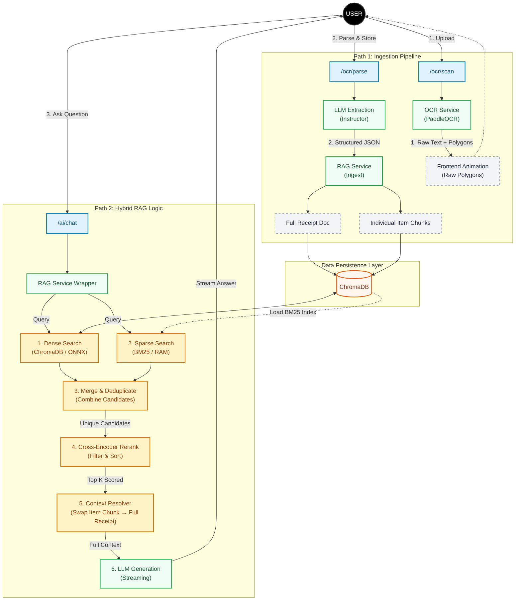

# Trace

<div align="center">

Next-Generation Financial Assistant leveraging Hybrid RAG, Quantized SLMs, and Optical Character Recognition.


</div>

### 📖 Overview
Trace is not just an expense tracker; it is a production-grade implementation of a RAG (Retrieval-Augmented Generation) pipeline designed to solve the "unstructured data" problem in personal finance.

While traditional expense trackers rely on manual entry, Trace uses PaddleOCR and Structured LLM Extraction to convert raw receipt images into type-safe JSON. It enables natural language queries over financial data by utilizing a Hybrid Search Engine that fuses dense vector retrieval with sparse keyword matching, re-ranked by a cross-encoder for maximum accuracy.

## ✨ Key Engineering Features

### 🧠 The "Smart Stack" (RAG Architecture)
Hybrid Search Strategy: Solves the limitations of pure vector search by combining ChromaDB (Dense/Semantic) with BM25 (Sparse/Keyword). This allows the system to understand concepts like "dinner" while still finding exact matches for "$42.50".

Cross-Encoder Reranking: Implements a "Judge" model (ms-marco-MiniLM-L-6-v2) running on ONNX Runtime to re-score retrieval candidates, drastically reducing hallucinations.

Semantic Chunking: Deconstructs receipts into two distinct vector types:

Full Document: For high-level summaries (Merchant, Total, Date).

Item Granularity: Individual vector embeddings for every line item, allowing queries like "How much have I spent on milk?".

Zero-Loss Fallback: Intelligent retrieval logic that falls back to a full-context scan if semantic search confidence drops below threshold.

### ⚡ High-Performance Backend
Asynchronous Processing: Built on FastAPI with fully async endpoints for non-blocking I/O.

ONNX Optimization: Embedding models and Rerankers are quantized and run via ONNX, removing the need for heavy PyTorch dependencies in production.

Streaming Responses: Utilizes Server-Sent Events (SSE) to stream LLM tokens to the frontend in real-time, reducing perceived latency.

### 🎨 Modern Frontend
Tech: React 19, TypeScript, and Vite.

UX: "Matrix-style" real-time OCR visualization using coordinate mapping from PaddleOCR.

State: TanStack Query for optimistic updates and caching.

### 🏗️ System Architecture
The following diagram illustrates the data ingestion and retrieval pipeline:



## 🛠️ Tech Stack

| Component         | Technology                | Description                                       |
| :---------------- | :------------------------ | :------------------------------------------------ |
| **Backend**       | ------------------------- | ------------------------------------------------- |
| Framework         | FastAPI                   | Async Python web server.                          |
| Vector Store      | ChromaDB                  | Persistent local vector storage.                  |
| OCR               | PaddleOCR                 | Lightweight, SOTA text detection.                 |
| LLM Orchestration | Instructor                | Structured output validation (Pydantic).          |
| Reranking         | Cross-Encoders (ONNX)     | Accelerated CPU inference for Cross-Encoders.     |
| **Frontend**      | ------------------------- | ------------------------------------------------- |
| Core              | React + Vite              | Fast component rendering.                         |
| Language          | TypeScript                | Strict type safety.                               |
| Styling           | TailwindCSS               | Utility-first styling.                            |
| UI Library        | Radix UI / Shadcn         | Accessible component primitives.                  |


## 🚀 Getting Started

### Prerequisites
Docker & Docker Compose
Ollama running Phi 3.5 (`ollama run phi3.5`)

### Installation

Clone the repository:

```bash
git clone https://github.com/createdbyadham/Trace.git
cd Trace
```

### Environment Configuration

Create a `.env` file in the `backend/` directory:

```
# LLM Configuration
OLLAMA_BASE_URL=http://localhost:11434
LLM_MODEL=phi3.5
```

```bash
# Create Virtual Environment
python -m venv venv
source venv/bin/activate  # Windows: venv\Scripts\activate

# Install Dependencies
pip install -r requirements.txt

# Run Server with Hot Reload
uvicorn main:app --reload --port 8000
```

📄 License
Distributed under the MIT License. See LICENSE for more information.
